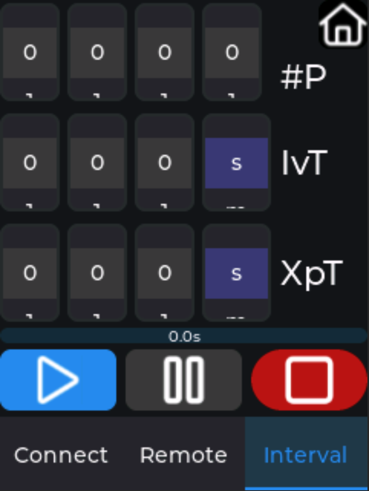

# CameraControl for Canon digital cameras with Bluetooth or WiFi conectivity

- Bluetooth is fully functional except for Wide and Tele Buttons. I've no Camera to check it.

- WiFi conectivity via Canon Connect API is implemented.

- WiFi conectivity via Picture Transfer Protocol via IP. (PTP/IP) is NOT implemented yet.

# Canon Camera Connect API
Canon Connect API. (all newer Canon cameras like Rxxx or M6m2)

You need the *CCAPI Activation Tool* from the [Canon Developers Program](https://developers.canon-europe.com/s/camera) to enable the Camera Connect API in your Camera. It it a good documented REST API to all settings, actions and events. In my opinion Canon should eneble the CCAPI by default. You find the additional CCAPI menu entry in the WiFi settings.

Im now implementing the Picture Transfer Protocol via IP. (PTP/IP)
(for all legacy WiFi cameras e.g. 5Dm4)

# Hardware

- [2432S028R - amazon.de](https://www.amazon.de/s?k=2432S028R&__mk_de_DE=%C3%85M%C3%85%C5%BD%C3%95%C3%91&crid=3B8TU5MJVTVY4&sprefix=2432s028r%2Caps%2C125&ref=nb_sb_noss_2)

- [2432S028R - aliexpress.com](https://de.aliexpress.com/w/wholesale-2432S028R.html?spm=a2g0o.home.search.0)

# Build environment

- [PlatformIO](https://platformio.org/)
  - [Choosing PlatformIO IDE for VSCode](https://platformio.org/install/ide?install=vscode)
- [Visual Studio Code](https://code.visualstudio.com/)
- [SquareLine Studio](https://squareline.io/) - UI Design

# Screeshots

## Start screen

## Bluetooth remote control screen

## Intervalometer

- #P : number of pictures to take

- IvT : Interval time between shots

- XpT : Exposure time, if XpT > IvT then IvT is set to 0s. Setting the Exposure time only makes sense in *BULB* mode. Minimum time between shots is 4s.
  